# Module 7 - Containers with Docker

## Project: Docker Fundamentals

Learn Docker fundamentals through a Node.js app: containerization, Docker Compose, private registry setup with Nexus, and production deployment.

---

## Table of Contents

1. [What is Docker?](#what-is-docker)
2. [Project Description](#project-description)
3. [App Overview](#app-overview)
4. [Technologies Used](#technologies-used)
5. [Prerequisites](#prerequisites)
6. [Use Docker for Local Development](#use-docker-for-local-development)
7. [Docker Compose - Run Multiple Docker Containers](#docker-compose---run-multiple-docker-containers)
8. [Dockerize a Node.js Application](#dockerize-a-nodejs-application)
9. [Deploy Nexus as a Docker Container](#deploy-nexus-as-a-docker-container)
10. [Create and Configure Docker Repository on Nexus](#create-and-configure-docker-repository-on-nexus)
11. [Deploy Dockerized Application on the Server](#deploy-dockerized-application-on-the-server)
12. [Persist Data With Docker Volumes](#persist-data-with-docker-volumes)

---

## What is Docker?

Docker is a platform that allows you to package applications and their dependencies into lightweight, portable containers. Think of a container as a standardized unit that includes everything your application needs to run: code, runtime, system tools, libraries, and settings.

### Why Use Docker?

**Consistency Across Environments:** Docker ensures your application runs the same way on your laptop, on a colleague's machine, and on production servers. No more "it works on my machine" problems.

**Isolation:** Each container runs in isolation, preventing conflicts between applications. You can run multiple applications with different dependency versions on the same machine without issues.

**Efficiency:** Containers are lightweight and start quickly compared to virtual machines. They share the host operating system's kernel, making them more resource-efficient.

**Simplified Development:** With Docker, you can spin up a complete development environment (database, cache, application) with a single command, making onboarding and collaboration much easier.

---

## Project Description

In this project, you'll learn Docker by working through practical tasks:

* **Use Docker for local development** - Run a Node.js application and MongoDB database in Docker containers locally, with Mongo Express as a database UI
* **Docker Compose - Run multiple Docker containers** - Write Docker Compose files to orchestrate multiple containers together
* **Dockerize a Node.js application** - Write a Dockerfile to build a Docker image for a Node.js application
* **Deploy Nexus as a Docker container** - Set up and run Nexus Repository Manager as a Docker container on a cloud server
* **Create and configure a Docker repository on Nexus** - Create a private Docker registry, configure permissions, and push images to it
* **Deploy a Docker application on a server** - Use Docker Compose to deploy your containerized application on a remote server
* **Persist data with Docker Volumes** - Configure Docker volumes to preserve database data across container restarts

---

## App Overview

The application located in the `/app` directory is a simple **User Profile Manager** designed to demonstrate full-stack containerization. It is focused on a **single user** scenario, allowing the viewing and updating of that specific user's profile information. It consists of:

* **Frontend** (`/app/src`): A web interface built with HTML, CSS, and JavaScript
* **Backend** (`/app/server.js`): A Node.js Express server that manages API endpoints for fetching and updating the user profile
* **Database**: MongoDB integration for persistent user data storage

> **⚠️ Security Warning**
> This project contains hardcoded credentials to facilitate following the guide and understanding the core Docker concepts. **This should NEVER be done in production.** Secure ways to manage sensitive information include using `.env` files, Docker secrets, or cloud provider secret managers.

---

## Technologies Used

* **Docker and Docker Compose**
* **Google Cloud** (or any other cloud infrastructure provider)
* **Node.js**
* **MongoDB**
* **Mongo Express**
* **Nexus Repository Manager**

---

## Prerequisites

* A cloud server: In this project we're going to use a Google Cloud instance
  * [Create a Google Cloud instance](./create-google-cloud-server.md#create-a-google-cloud-instance)
* An admin user with access to the server via SSH
  * [Create an admin user](https://github.com/ana-os-mo/digital-ocean-server/blob/main/README.md#step-3-connect-and-configure-a-secure-admin-user)

**Recommended Server Specifications:** To ensure Nexus Repository operates smoothly and to successfully deploy applications using Docker as outlined in this guide, your server should meet the following minimum specifications:

* **Operating System:** Ubuntu Linux 22.04 LTS or above
* **RAM:** 8 GB
* **CPUs:** 4 vCPUs
* **Storage:** 160 GB

> **Note:** While you can run with lower specifications for learning purposes, using less than these recommended specs may result in slow build times, service timeouts, or application crashes when multiple services run concurrently.

---

## Use Docker for Local Development

Docker is extremely valuable for development because it eliminates environment inconsistencies. Instead of each developer installing and configuring tools, and other dependencies on their local machine (which can lead to version conflicts and configuration errors), everyone uses the same containerized environment.

In this section, we'll start our development environment by running Docker commands manually. This approach helps you understand what Docker is doing under the hood. Later, we'll use Docker Compose to simplify this process by automating these commands.

### Why Docker for Development?

* **No Local Installation Required:** You don't need to install MongoDB or other services directly on your machine
* **Version Control:** Everyone on the team uses the exact same version of MongoDB, Node.js, and other services
* **Easy Cleanup:** When you're done, simply stop and remove the containers—your system stays clean
* **Quick Setup:** New team members can get started in minutes instead of hours

For detailed explanations of the commands used below, review the [Docker Commands](./docker-commands.md) file.

### Start the Application Using Docker Commands

Make sure that Docker is running on your machine. You can pull an image with the command `docker pull` and the image name. When you use `docker run`, if the image is not found locally, Docker will automatically pull it for you.

```bash
# Example
docker pull mongo:7.0
```

1. **Create a Docker network**

    Docker containers are isolated by default. To allow containers to communicate with each other (for example, so your application can connect to MongoDB), we create a custom network.

    ```bash
    docker network create mongo-network
    ```

2. **Start MongoDB**

    This command starts a MongoDB container with admin credentials and connects it to our custom network.

    ```bash
    docker run -d \
    -p 27017:27017 \
    -e MONGO_INITDB_ROOT_USERNAME=admin \
    -e MONGO_INITDB_ROOT_PASSWORD=password \
    --name mongodb \
    --net mongo-network \
    mongo:7.0
    ```

3. **Start Mongo Express**

    Mongo Express provides a web-based UI to interact with MongoDB. It needs to connect to the MongoDB container using the network we created.

    ```bash
    docker run -d \
    -p 8082:8081 \
    -e ME_CONFIG_MONGODB_ADMINUSERNAME=admin \
    -e ME_CONFIG_MONGODB_ADMINPASSWORD=password \
    -e ME_CONFIG_BASICAUTH_USERNAME=user \
    -e ME_CONFIG_BASICAUTH_PASSWORD=pass \
    -e ME_CONFIG_MONGODB_SERVER=mongodb \
    -e ME_CONFIG_MONGODB_URL=mongodb://mongodb:27017 \
    --net mongo-network \
    --name mongo-express \
    mongo-express:1.0.2
    ```

4. **Open Mongo Express from the browser**

    In your browser, navigate to `http://localhost:8082` and log in with the basic auth credentials. Username: `user`, Password: `pass`

5. **Configure the database**

    Create a database called `user-account` by typing the name in the database field and clicking the `Create Database` button.

    <p align="center">
        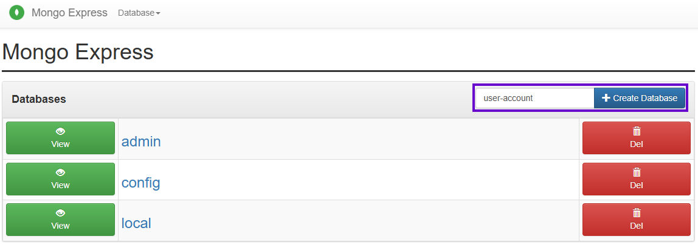
    </p>

    Open the `user-account` database and then create a collection called `users` by typing the name in the collection field and clicking the `Create collection` button.

    <p align="center">
        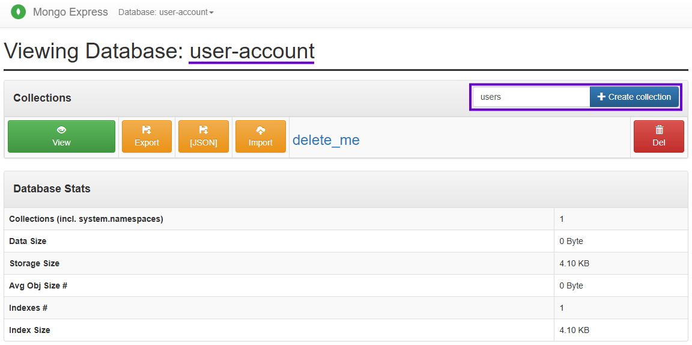
    </p>

    You can use any other names for the database and collection, but in such case you will need to change the names in the code too:

    ```js
    // app/server.js file
    const DB_NAME = "user-account";
    const COLLECTION_NAME = "users";
    ```

6. **Start the Node.js application locally**

    The application itself is not yet containerized, it runs directly on your machine.

    ```bash
    # Move to the app directory
    cd app

    # Install the app dependencies
    npm install

    # Start the app
    npm start
    ```

7. **Access your Node.js application UI from browser**

    Navigate to `http://localhost:3000`

At this point, you have MongoDB and Mongo Express running in Docker containers, while your Node.js application runs locally and connects to the containerized MongoDB.

---

## Docker Compose - Run Multiple Docker Containers

Running containers individually with `docker run` commands works, but it has drawbacks:

* **Repetitive:** You have to remember and type multiple long commands
* **Error-Prone:** It's easy to forget a flag or environment variable
* **Hard to Share:** Your teammates would need to run the same commands manually

**Docker Compose** solves these problems by allowing you to define all your containers, networks, and configurations in a single YAML file. With one command, you can start or stop your entire development environment.

### Advantages of Docker Compose

* **Declarative Configuration:** All container configurations are defined in one file
* **Single Command:** Start everything with `docker compose up` and stop with `docker compose down`
* **Version Control:** The compose file can be committed to Git, so everyone has the same setup
* **Easier Maintenance:** Updating configurations is as simple as editing a YAML file

In this section, we'll use the `docker-compose-dev.yaml` file to start MongoDB and Mongo Express. This file contains comments explaining what each line does, review it to understand the configuration.

### Start the Application Using Docker Compose

1. **Start MongoDB and Mongo Express**

    From the project root, run the following command. The `-d` flag runs the containers in detached mode (in the background).

    ```bash
    docker compose -f docker-compose-dev.yaml up -d
    ```

2. **Configure the database and run the application**

    Follow steps 4 through 7 from the [Use Docker for Local Development](#use-docker-for-local-development) section above.

### Viewing Container Logs

You can use the following commands to see the logs, or omit the `-d` flag in the `docker compose` command to see the logs from the beginning.

```bash
# See the last 10 lines of logs for a container
docker logs <container_id> | tail

# See the logs of a container in real time
docker logs <container_id> -f
```

---

## Dockerize a Node.js Application

So far, we've run third-party images (MongoDB, Mongo Express) from Docker Hub. Now we'll create our own Docker image for the Node.js application.

### What is a Dockerfile?

A **Dockerfile** is a text file containing instructions that tell Docker how to build an image. Each instruction creates a layer in the image, and Docker caches these layers for faster subsequent builds.

### How Does a Dockerfile Work?

When you run `docker build`, Docker reads the Dockerfile and executes each instruction in order:

1. **FROM:** Specifies the base image (e.g., Node.js)
2. **WORKDIR:** Sets the working directory inside the container
3. **COPY:** Copies files from your machine into the container
4. **RUN:** Executes commands (e.g., install dependencies)
5. **ENV:** Sets environment variables
6. **USER:** Specifies which user runs the application
7. **EXPOSE:** Documents which port the application uses
8. **CMD:** Defines the command to run when the container starts

More details in the [Dockerfile Keywords Reference](./dockerfile-keywords-reference.md)

### Why Dockerize Your Application?

Once your application is developed and tested, you need to deploy it. Dockerizing ensures:

* **Consistency:** The application runs identically in development, testing, and production
* **Portability:** The same image can run on any server with Docker installed
* **Scalability:** You can easily run multiple instances of your application
* **CI/CD Integration:** Automated pipelines can build, test, and deploy Docker images

### Build a Docker Image from the Application

The Dockerfile is located at the root of the project and contains comments explaining what each line does. Review it to understand how the image is built.

From the project root, execute the following command to build the image:

```bash
docker build -t node-app:1.0.0 .
```

The `-t` flag tags the image with a name and version. The `.` specifies the build context (the current directory).

After the build completes, verify that the image was created:

```bash
docker images
```

You should see `node-app:1.0.0` in the list.

If you have the Dockerfile and the context in different locations, you can use the following command.

```bash
docker build -t <image-name>:<image-tag> -f <path/to/Dockerfile> <path/to/context>
```

---

## Deploy Nexus as a Docker Container

Nexus Repository Manager is an artifact repository that can store Docker images, npm packages, and more. We'll use it to create a private Docker registry for our application images.

In [a previous project](https://github.com/ana-os-mo/nexus-repository-manager) we saw how to install Nexus Repository manually directly on the server. This is another method, even faster, using Docker.

### Why Use Docker for Nexus?

Running Nexus in a Docker container offers several advantages:

* **Faster Setup:** No manual installation or configuration of Java and dependencies
* **Isolation:** Nexus runs in its own environment without affecting the host system
* **Easy Upgrades:** Simply pull a new image version and restart the container
* **Portability:** Move Nexus to a different server by migrating the volume

For learning purposes we're going to use `snap` to install docker (this is not recommended for production environments).

### Install Docker on the Server

For learning purposes we're going to use `snap` to install Docker (this is not recommended for production environments, where you should use the official Docker installation method).

1. **Connect to the server via SSH**

    Remember to use an admin user, not the root user.

2. **Install Docker**

    ```bash
    sudo snap install docker
    ```

### Run Nexus as a Container

1. **Pull the Nexus image**

    ```bash
    sudo docker pull sonatype/nexus3:3.87.2-alpine
    ```

2. **Run the image with Nexus port mapped and named volume**

    ```bash
    sudo docker run -d \
    --restart unless-stopped \
    -p 8081:8081 -p 8083:8083 \
    --name nexus \
    -v nexus-data:/nexus-data \
    sonatype/nexus3:3.87.2-alpine
    ```

    **Flags explained:**
    * `-d`: Run in detached mode (background)
    * `--restart unless-stopped`: Automatically restart the container if Docker stops and starts again, or if the server reboots (unless you manually stopped it)
    * `-p 8081:8081`: Map port 8081 (Nexus web UI)
    * `-p 8083:8083`: Map port 8083 (will be used later for the Docker registry)
    * `--name nexus`: Name the container "nexus" for easier reference
    * `-v nexus-data:/nexus-data`: Create a named volume to persist Nexus data

3. **Open port 8081 on the server firewall for Nexus**

    You can see how to open the ports [in this file](./create-google-cloud-server.md#firewall-and-ports) for Google Cloud instances.

### Access Nexus and Get Initial Password

Now you can access Nexus as usual from your browser by navigating to `http://<server-ip>:8081`.

When you first access Nexus, it will ask for the initial admin password. You can retrieve it in two ways:

**Option 1:** From the Docker volume

```bash
# Get the volume mountpoint path
sudo docker inspect nexus-data

# Print the password (path may vary based on your Docker installation)
sudo cat /var/snap/docker/common/var-lib-docker/volumes/nexus-data/_data/admin.password
```

**Option 2:** Accessing the container

```bash
# Access the container's shell
sudo docker exec -it nexus sh

# Print the password
cat /nexus-data/admin.password
```

After retrieving the initial password, complete the setup wizard in the Nexus web UI to set a new admin password.

Everything else is pretty much the same as in [nexus-repository-manager](https://github.com/ana-os-mo/nexus-repository-manager).

---

## Create and Configure Docker Repository on Nexus

To store our Docker image in the Nexus repository and allow pulling it from the server, we first need to create and configure the repository in Nexus, then configure Docker on our local machine to communicate with it.

### Create a Docker Hosted Repository

A "hosted" repository stores artifacts that you upload (as opposed to a "proxy" repository that caches artifacts from other registries).

Log in to Nexus as admin and follow these steps:

1. **Navigate to repositories**

    Click on the gear icon (⚙️) → Repository → Repositories → Create repository

    <p align="center">
        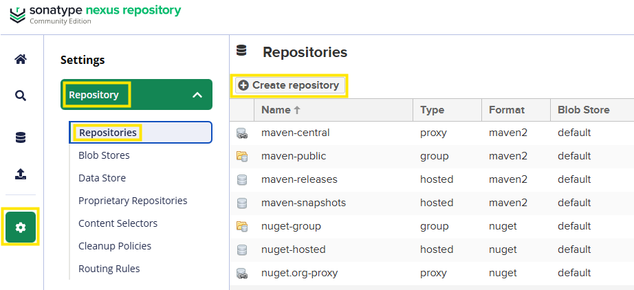
    </p>

2. **Select "docker (hosted)"**

    <p align="center">
        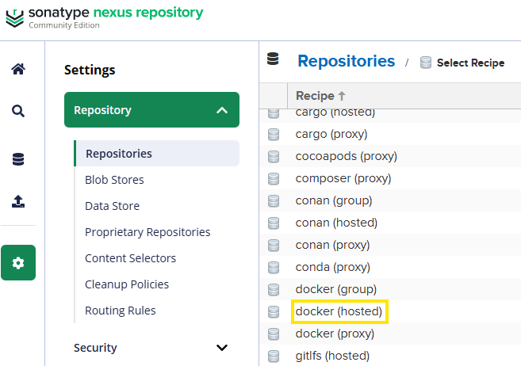
    </p>

3. Assign a name, select a blob store (you can create a blob store or use the default one), and configure an available port to access the repository via HTTP. In this example, we're going to use port `8083`, which we previously mapped when running the Nexus container.

    <p align="center">
        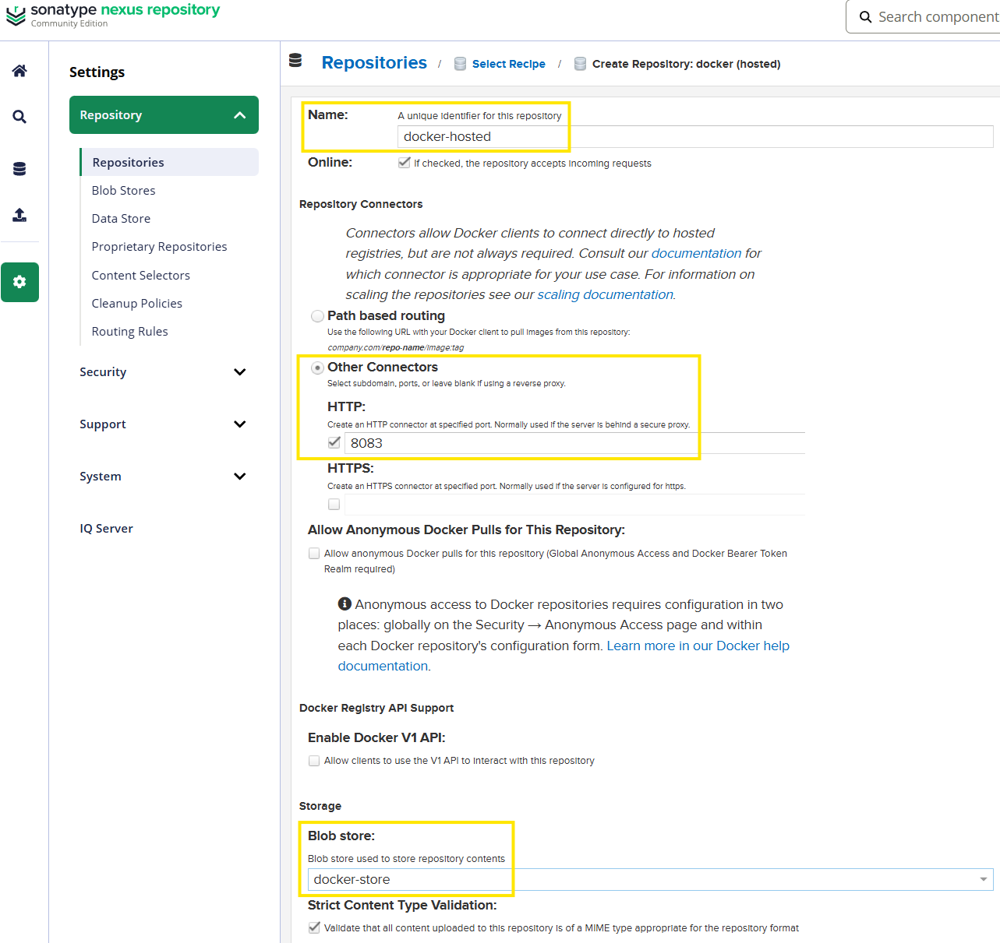
    </p>

    More information can be found in the [Nexus documentation](https://help.sonatype.com/en/docker-registry.html#port-connectors).

4. **Get the repository URL**

    Open the created repository to view its URL: `http://<server-ip>:8081/repository/docker-hosted/`. You can use this URL if you want to interact with the repository using the Nexus API for HTTP requests.

    <p align="center">
        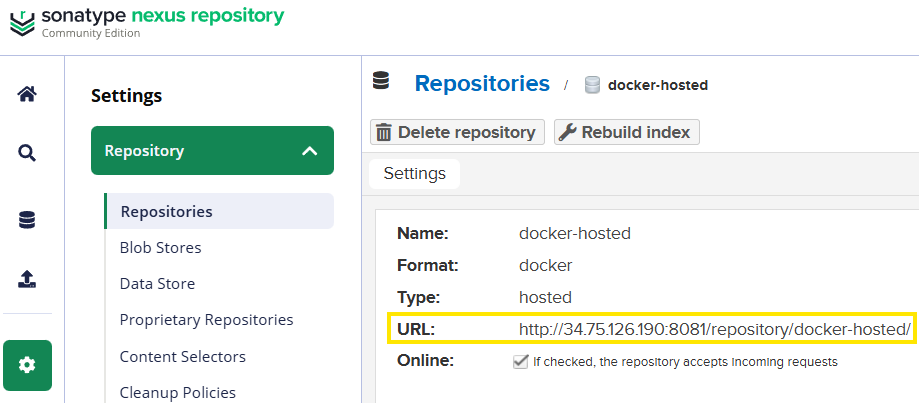
    </p>

### Create a User and a Role

Following security best practices, we need to create a dedicated user with permissions only to interact with the Docker repository (upload and download Docker artifacts). We assign these permissions through a role.

**Why create a separate user?**

* **Principle of Least Privilege:** The user only has access to what it needs
* **Security:** If credentials are compromised, the damage is limited
* **Auditability:** You can track who pushed which images

#### Create a Role for the Docker Repository

Roles define what actions users can perform.

1. **Navigate to Security → Roles → Create role**

2. **Create a Nexus role** (not an external role mapping)

3. **Configure the role**

    * **Role ID:** `nx-docker`
    * **Role name:** `nx-docker`
    * **Privileges:** Add the following:
        * `nx-repository-view-docker-docker-hosted-*`

4. **Save the role**

<p align="center">
    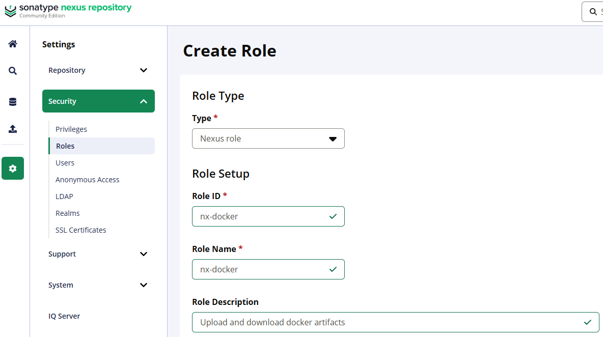
</p>

<p align="center">
  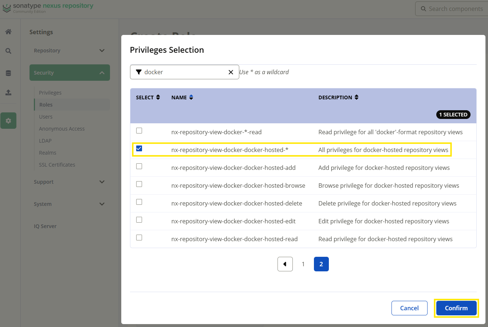
</p>

#### Create a User and Assign the Role

1. **Navigate to Security → Users → Create local user**

2. **Configure the user**

    <p align="center">
        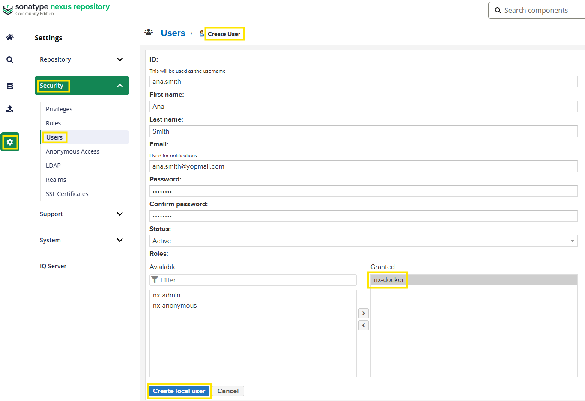
    </p>

3. **Create the user**

### Configure Docker and Nexus to Use the Docker Repository

To push images to your private repository, you need to configure Docker to communicate with Nexus.

1. **Open the Docker port on the server firewall**

    Open port `8083` in your cloud provider's firewall settings.

    Google Cloud: [Firewall and Ports](./create-google-cloud-server.md#firewall-and-ports)

2. **Configure Nexus Realm**

    When you run `docker login`, you receive an authentication token from the Nexus Docker repository. This token is stored on your local machine in `~/.docker/config.json` and is used for subsequent operations.

    For Nexus to issue this token, you need to activate the **Docker Bearer Token Realm**:

    * In Nexus, go to Settings (⚙️) → Security → Realms
    * Move `Docker Bearer Token Realm` from "Available" to "Active"
    * Save

      <p align="center">
          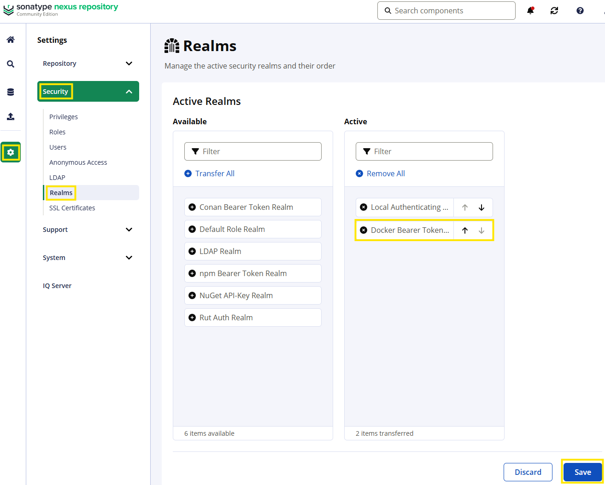
      </p>

3. **Configure Docker client on your local machine**

    In this example, we're using an insecure HTTP endpoint (not HTTPS). By default, Docker only allows connections to secure registries, so we need to configure Docker to allow insecure connections.

    Follow the [instructions for your OS](https://distribution.github.io/distribution/about/insecure/#deploy-a-plain-http-registry) to configure Docker.

    On most systems, edit or create `/etc/docker/daemon.json` (Linux) or use Docker Desktop settings (macOS/Windows):

    ```json
    {
      "insecure-registries" : ["<server-ip>:8083"]
    }
    ```

    Replace `<server-ip>` with your actual server IP address. For example:

    ```json
    {
      "insecure-registries" : ["34.23.223.36:8083"]
    }
    ```

    After editing, restart Docker for the changes to take effect.

### Build and Push the Image

1. **Log in to the registry**

    In your local terminal, execute:

    ```bash
    # Your docker registry <server-ip>:<docker-port>
    docker login 34.23.223.36:8083
    ```

    Use the credentials for the user you created in Nexus (e.g., `my-user`). You should see the message: `Login Succeeded`.

2. **Tag the image to include the registry**

    Docker images are named as `registryDomain/imageName:tag`. For Docker Hub (the public registry), the domain is `docker.io/library`, which is why you can pull images like this:

    ```bash
    docker pull docker.io/library/mongo:7.0
    # Or simply: docker pull mongo:7.0
    ```

    For your private registry, you must specify the registry domain: `<server-ip>:<docker-port>`.

    Tag your image to include the registry domain:

    ```bash
    # <name>:<tag> <resgistry-domain>/<name>:<tag>
    docker tag node-app:1.0.0 34.23.223.36:8083/node-app:1.0.0
    ```

    If you run `docker images`, you'll see the same image twice (same image ID) with different tags.

    **Note:** You can also tag the image during the build:

    ```bash
    docker build -t 34.23.223.36:8083/node-app:1.0.0 .
    ```

3. **Push the image to the repository**

    ```bash
    docker push 34.23.223.36:8083/node-app:1.0.0
    ```

    After the push completes, open the Nexus UI and verify that the image was uploaded:

    * Navigate to Browse → docker-hosted

    <p align="center">
        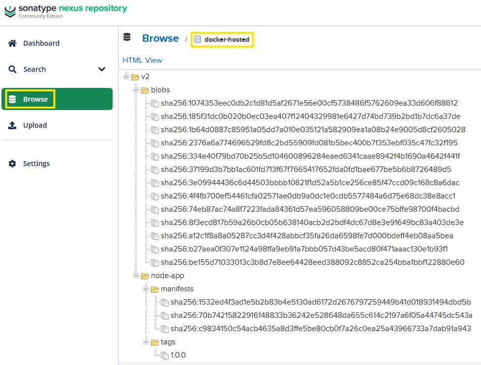
    </p>

### Verify the Image

You can fetch the image metadata using the Nexus API:

```bash
# curl -u <username>:<password> -X GET '<server-ip>:<nexus-port>/service/rest/v1/components?repository=docker-hosted'
curl -u my-user:my-password -X GET '34.23.223.36:8081/service/rest/v1/components?repository=docker-hosted'
```

You can also pull the image with Docker to verify it's accessible:

```bash
docker pull 34.23.223.36:8083/node-app:1.0.0
```

---

## Deploy Dockerized Application on the Server

Now we'll deploy the complete application (Node.js app, MongoDB, and Mongo Express) on the server using Docker Compose. The application image will be pulled from your private Nexus registry, while MongoDB and Mongo Express will be pulled from Docker Hub.

### Configure Docker and Log In to the Registry on the Server

The server needs to be configured to allow connections to your insecure registry, just like your local machine.


1. **Edit the Docker daemon configuration**

    On Ubuntu Linux, the path for Docker installed via snap is:

    ```bash
    sudo vim /var/snap/docker/current/config/daemon.json
    ```

    Add the following configuration (replace the IP with your actual server IP):

    ```json
    {
      "insecure-registries" : ["34.23.223.36:8083"]
    }
    ```

2. **Restart Docker to apply the changes**

    ```bash
    sudo snap restart docker
    ```

3. **Log in to the registry**

    ```bash
    sudo docker login 34.23.223.36:8083
    ```

    Use the Nexus user credentials you created earlier.

### Copy the Compose File to the Server

From your local machine, in the root of the project, copy the production compose file to the server:

```bash
scp ./docker-compose-prod.yaml your-user@34.23.223.36:/home/your-user
```

### Run the Application on the Server

1. **SSH into the server**

    ```bash
    ssh your-user@34.23.223.36
    ```

2. **Navigate to the location of the compose file**

    ```bash
    cd /home/your-user
    ```

3. **Start the application**

    ```bash
    sudo docker compose -f docker-compose-prod.yaml up -d
    ```

    Docker Compose will:
    * Pull the Node.js app image from your Nexus registry
    * Pull MongoDB and Mongo Express from Docker Hub
    * Create the containers and start them

### Open Ports for the Application

To access your application and Mongo Express from the internet, you need to open the necessary ports on your server's firewall:

* **Port 3000:** Node.js application
* **Port 8082:** Mongo Express (optional, for database management)

Follow the same firewall configuration steps you used for Nexus: [Firewall and Ports](./create-google-cloud-server.md#firewall-and-ports)

After opening the ports, you can access:

* Your application at `http://<server-ip>:3000`
* Mongo Express at `http://<server-ip>:8082`

---

## Persist Data With Docker Volumes

Currently, every time you stop and remove the containers, all database data is lost. When you start the containers again, you have to recreate the database and collections from scratch.

### What Are Docker Volumes?

**Docker volumes** are a mechanism for persisting data generated by and used by Docker containers. When a container is removed, its filesystem is deleted, but volumes exist outside the container filesystem and persist independently.

Think of volumes as external hard drives attached to containers. Even if you delete the container, the data on the "hard drive" remains.

### Why Use Docker Volumes?

* **Data Persistence:** Keep data even when containers are stopped, removed, or recreated
* **Performance:** Volumes are optimized for I/O operations
* **Sharing Data:** Multiple containers can share the same volume
* **Backup and Migration:** Volumes can be easily backed up or moved to other hosts

### Types of Docker Volumes

1. **Named Volumes** (Recommended for most use cases)

    Managed by Docker. You give the volume a name, and Docker handles where it's stored on the host.

    ```bash
    docker run -v my-volume:/data
    ```

    * **Pros:** Easy to use, managed by Docker, portable
    * **Use case:** Production databases, application data

2. **Host Volumes** (Bind Mounts)

    You specify an exact path on the host machine to mount into the container.

    ```bash
    docker run -v /path/on/host:/path/in/container
    ```

    * **Pros:** Direct access to files on the host
    * **Cons:** Less portable, tied to specific host paths
    * **Use case:** Development (syncing code changes), configuration files

3. **Anonymous Volumes**

    Created automatically by Docker without a name.

    ```bash
    docker run -v /data
    ```

    * **Pros:** Simple
    * **Cons:** Hard to manage and reference
    * **Use case:** Temporary data that doesn't need to persist long-term

### Using Docker Volumes in Docker Compose

For this application, we'll use **named volumes** to persist MongoDB data.

### Add Docker Volume to the Compose File

In the `docker-compose-prod.yaml` file, we define a volume for MongoDB:

```yaml
services:
  node-app:
    ...
  mongodb:
    image: mongo:7.0
    ...
    # Mount the volume to the path where MongoDB stores its data
    volumes:
     - mongodb-data:/data/db
  ...

# List of all volumes used by any of the containers
volumes:
  mongodb-data:
    # Tell Docker to create the volume on the host filesystem
    driver: local
```

**Explanation:**

* `mongodb-data:/data/db` mounts the named volume `mongodb-data` to `/data/db` inside the container (MongoDB's data directory)
* The `volumes` section at the bottom declares the named volume and tells Docker to create it using the `local` driver

> **Note:** Make sure to uncomment the Docker volumes lines in the `docker-compose-prod.yaml` file.

### Verify Data Persistence

1. **Start the containers with volumes enabled**

    ```bash
    sudo docker compose -f docker-compose-prod.yaml up -d
    ```

2. **Create some data** in your application or directly in Mongo Express

3. **Stop and remove the containers**

    ```bash
    sudo docker compose -f docker-compose-prod.yaml down
    ```

4. **Start the containers again**

    ```bash
    sudo docker compose -f docker-compose-prod.yaml up -d
    ```

5. **Verify that your data is still there**

The data persists because it's stored in the volume, not in the container's filesystem.

### Where Are Docker Volumes Located?

On Linux, Docker volumes are stored in `/var/lib/docker/volumes/`.

For this project, on the server, you can list the volume data with:

```bash
ls /var/lib/docker/volumes/<app-named-volume>/_data/
```

You can also view the data inside the MongoDB container:

```bash
# Access the container shell
docker exec -it <container-id> sh

# List MongoDB data directory
ls /data/db
```

You'll see that both locations contain the same data.

### Managing Docker Volumes

List all volumes:

```bash
docker volume ls
```

Inspect a specific volume to see its details:

```bash
docker inspect <volume-name>
```

Remove a volume (only works if no containers are using it):

```bash
docker volume rm <volume-name>
```

Remove all unused volumes:

```bash
docker volume prune
```
