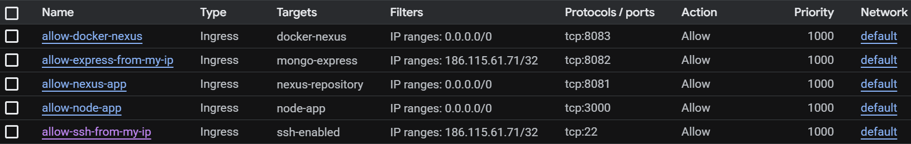
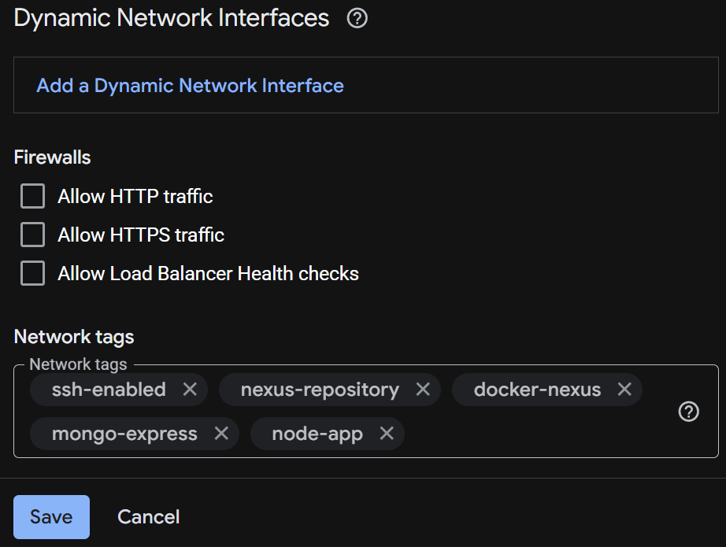

# Google Cloud Server

[**Google Cloud**](https://cloud.google.com/free) offers a free trial that can be used to create an instance as an alternative to [**Digital Ocean**'s](https://github.com/ana-os-mo/digital-ocean-server) droplet.

## Create a Google Cloud Instance

The following steps explain how to create the instance. For any option not specified, you can leave the default values.

### Machine Configuration

1. From the navigation menu, navigate to `Compute Engine > VM instances` and click on `Create instance`.

2. Choose a `Region` near your location with any zone.

3. Select an `E2` machine type. You can use the `e2-standard-4` (4 vCPU, 2 core, 16 GB memory).

### OS and Storage

1. In the "Operating system and storage" section, click on `Change`.

2. Choose the following options:
    - Operating system: Ubuntu
    - Version: Ubuntu 24.04 LTS (x86/64, amd64)
    - Size (GB): 160

### Data Protection

You can decide whether to enable backups. Keep in mind that backups have an additional cost that will be charged to your free credits.

### Networking

Leave this section unchanged for now. We will configure the firewall later.

### Observability

You can keep the default settings or uncheck `Install Ops Agent for Monitoring and Logging` to reduce costs.

### Security

1. Click on `Manage access`.

2. Click on the `Add item` button and paste your public SSH key.

3. Click on `Create` (you can skip the `Advanced` section).

## Firewall and Ports

By default, Google Cloud has some firewall rules already created. Review and remove any you don't need or consider insecure. We'll use tags to apply custom firewall rules to our instance.

The following steps show how to create a firewall rule and assign it to your instance to open a specific port.

### Configure the Firewall

1. Navigate to `VPC Network > Firewall`.

2. Click on `Create firewall rule`.

3. Create rules to open the necessary ports. Configure the following settings for each rule (unspecified options can remain at their default values):

    - **Name:** A descriptive identifier for the rule
    - **Direction of traffic:** Specifies whether the rule applies to incoming or outbound traffic. Use `Ingress` for all the rules.
    - **Action on match:** Determines whether matching traffic is allowed or denied. Use `Allow` for all of them.
    - **Targets:** Choose `Specified target tags`.
    - **Target tags:** Tag name to associate with the rule.
    - **Source filter:** IPv4 ranges
    - **Source IPv4 ranges:** Use `0.0.0.0/0` for public access, or specify an IP address to restrict access to a single source.
    - **Protocols and ports:** Choose `Specified protocols and ports`, then select `TCP` and enter the desired port number.

4. Click on `Create`.

Repeat these steps for each port you need to open. By the end of this project, your configuration will look similar to this:

    

### Open the Instance Ports

1. Open your instance and click on `Edit`.

2. Scroll down to `Network tags`, assign the tag or tags corresponding to your firewall rules you want to apply, and click `Save`.

    

